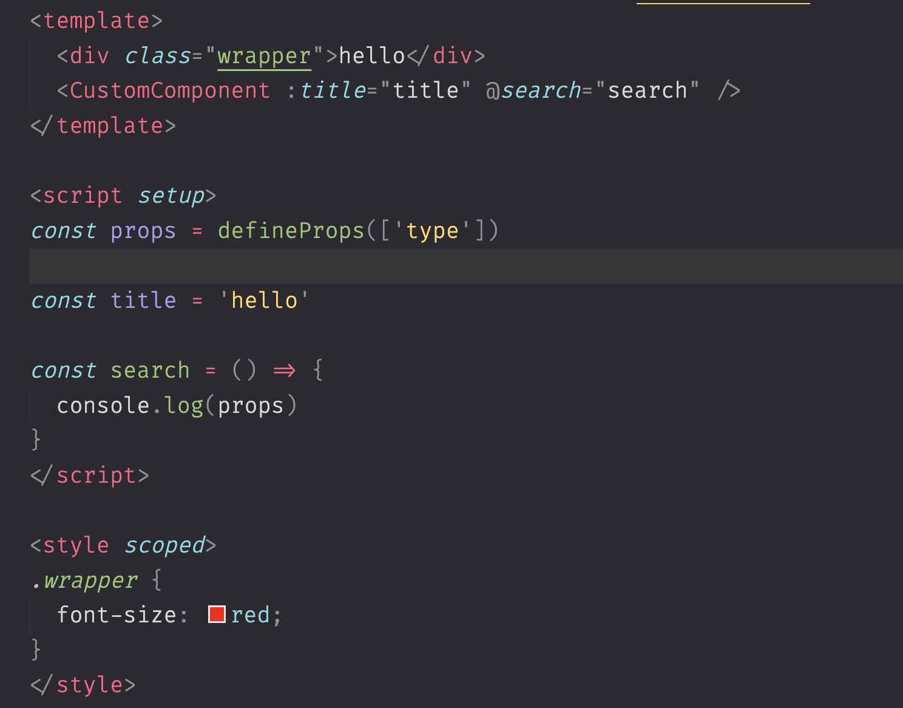

# Monokai Pro Muted

这是一个基于 VS Code 官方 Monokai Pro 主题的自定义配置文件。  
主要特点是降低了代码高亮的亮度，使整体配色更加柔和。

## 特色

- 保留 Monokai Pro 原有风格
- 降低高亮颜色亮度，减少视觉疲劳
- 适合喜欢低饱和度、低对比度主题的开发者

## 使用方法

1. 打开 VS Code 设置（settings.json）
2. 将本仓库中的相关配置内容复制到你的 `settings.json`
3. 选择 `Monokai Pro` 主题即可生效

## 预览

